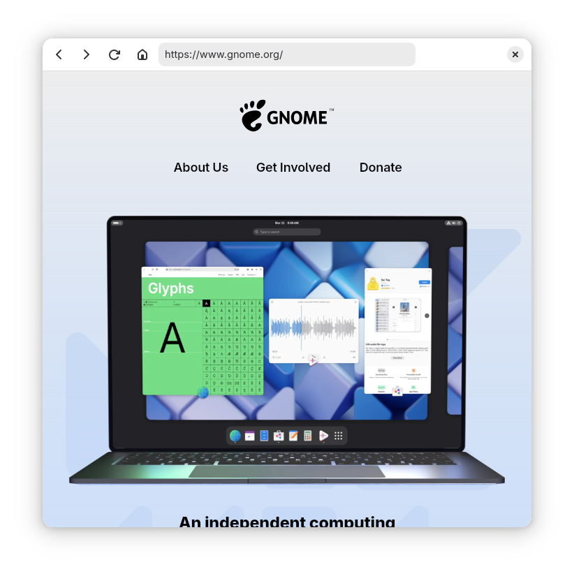

## Browser

This example is a simple web browser application based on WebkitGtk and LibAdwaita.  It was inspired by the browser example in GNOME Workbench.

To run the example, clone the repository, navigate to the `Browser` folder, and execute `gradle run`.

