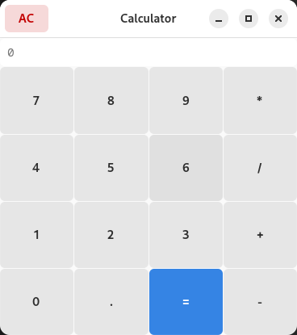

## Calculator

This example is a simple calculator that uses Gtk and LibAdwaita. There's a header bar, and a grid-based layout for the buttons. The app reacts to key presses as expected. It loads a CSS file to apply a few small visual tweaks.

To run the example, clone the repository, navigate to the `CalculatorKotlin` folder, and execute `gradle run`.

