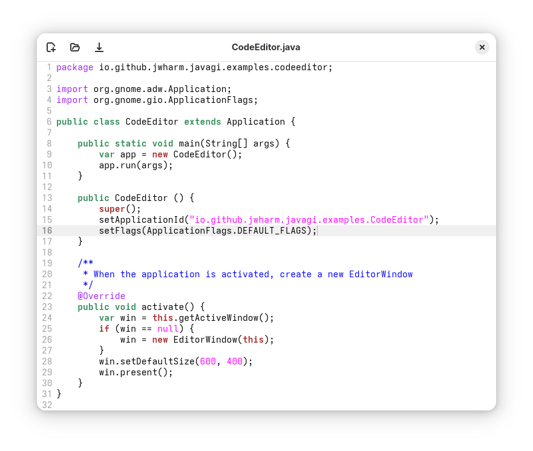

## Source code editor

This example is a small Adwaita application to edit text in a GtkSourceView component.

It is very much like the Notepad example, but this one uses the`GtkSourceView` instead of the `GtkTextView` widget, with line numbers and syntax highlighting enabled.

To run the example, clone the repository, navigate to the `CodeEditor` folder, and execute `gradle run`.

