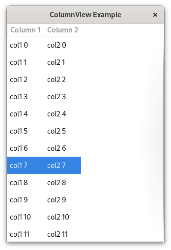

## ColumnView Datagrid

This example displays a long, scrollable datagrid with simple string data, demonstrating how to use a Gio ListStore with a custom Java class for the row data.  It is originally based on [this Gtk-rs example](https://github.com/gtk-rs/gtk4-rs/tree/master/examples/column_view_datagrid).

To run the example, clone the repository, navigate to the `ColumnViewDatagrid` folder, and execute `gradle run`.

