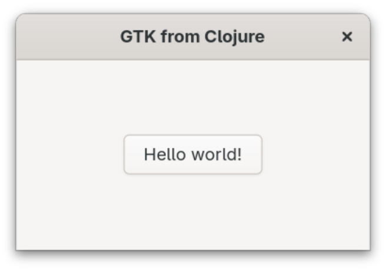

## Hello World (Clojure)

This example is a simple "Hello World" Gtk application in Clojure.

To run the example, clone the repository, navigate to the `HelloWorldClojure` folder, and execute `clj -Xhello hello/run`.

