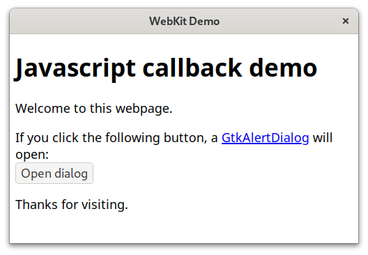

## Javascript callback

This example is a small WebkitGtk application that runs a Java callback function from a Javascript function in the webpage.

To run the example, clone the repository, navigate to the `Javascript` folder, and execute `gradle run`.

