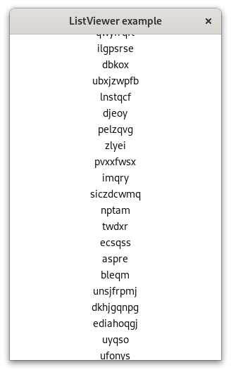

## List Viewer

This example displays a long, scrollable list with randomly generated words. It demonstrates how you can use a Java ArrayList to implement the GListModel interface, which is central to all modern Gtk list widgets.

To run the example, clone the repository, navigate to the `ListViewer` folder, and execute `gradle run`.

