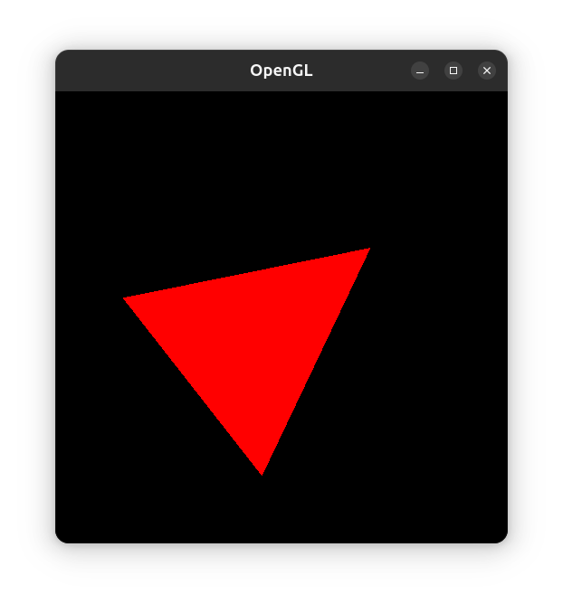

## OpenGL

This example demonstrates an integration of 3D view in a Gtk application.

It uses:
* [LWJGL](https://www.lwjgl.org/) for OpenGL rendering, supporting both GL & GLES APIs
* [JOML](https://github.com/JOML-CI/JOML) to handle maths

To run the example, clone the repository, navigate to the `OpenGL` folder, and execute `gradle run`.

