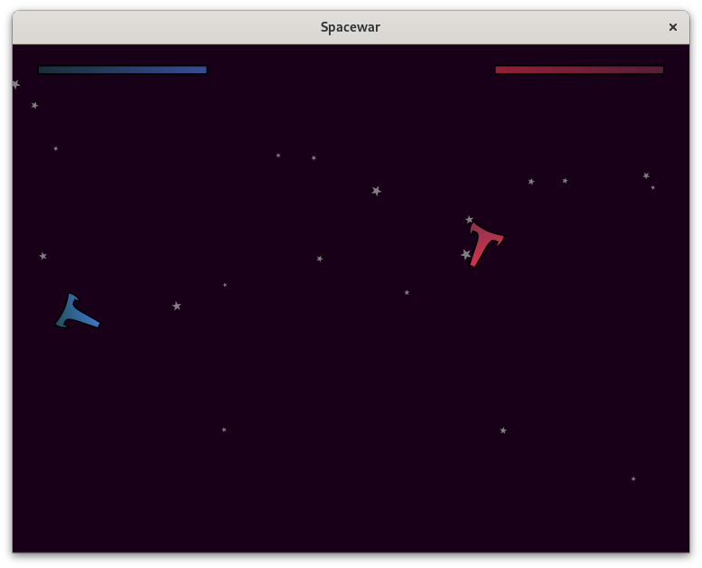

## Spacewar

This example is a port of the cairo "SVG Spacewar" demo to GTK 4 and Kotlin.
The original can be found [here](https://gitlab.com/cairo/cairo-demos). It is
mostly identical to the original, but uses a `GdkPaintable` for drawing.

### Controls

The blue spaceship is controlled with a/w/d and left control, the right one
with cursor keys and right control. Zoom in and out with left and right
brackets. Quit the game with Escape.

### License

Both the original demo and this program are licensed under the GNU GPL.

